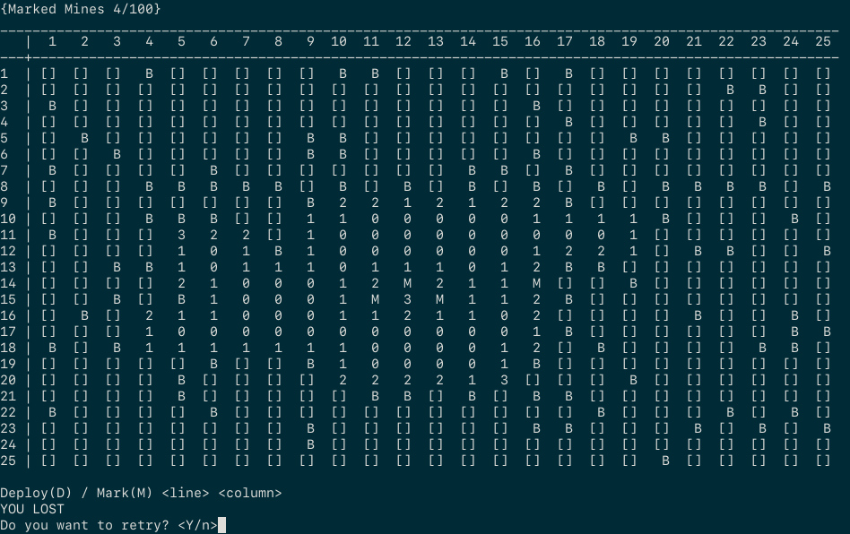

# MineSweeper

## Overview

This project is a CLI copy of the [Microsoft Minesweeper](https://en.wikipedia.org/wiki/Microsoft_Minesweeper) game. It was created as a high school project that demonstrates the application of the [Lee Algorithm](https://en.wikipedia.org/wiki/Lee_algorithm).



## Prerequisites

For building the project you need the following prerequisites:

- **gcc**/**clang** compiler that supports **C++ 11**
- **cmake** with the version greater than **3.15**
- **make** unix utility

## Building & Running

To **build**, **run** and **clean** the project use the scripts located inside the [scripts](scripts) directory.

**Build:**

```bash
scripts/build.sh
```

**Run:**

```bash
scripts/run.sh
```

**Clean:**

```bash
scripts/cleanup.sh
```
